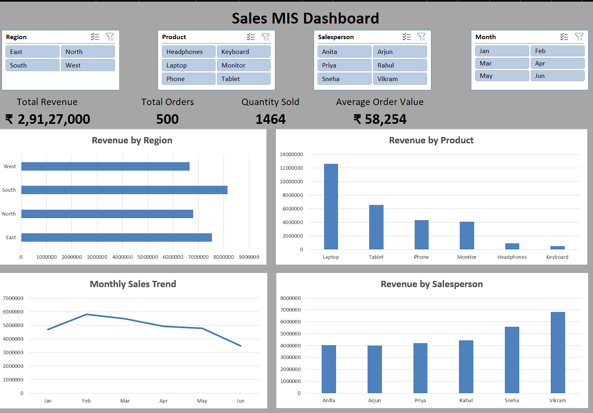

# Sales MIS Dashboard (Excel)

## Overview
This project is an interactive Sales MIS Dashboard built using Microsoft Excel.

The dashboard analyzes sales data and provides insights into revenue performance across regions, products, and salespersons.

## Features
- KPI Metrics (Total Revenue, Total Orders, Quantity Sold, Avg Order Value)
- Interactive slicers for filtering
- Pivot Tables for aggregation
- Dynamic charts for visualization

## Tools Used
- Microsoft Excel
- Pivot Tables
- Pivot Charts
- Slicers
- Data formatting

## Dashboard Preview

## Insights
- Laptop is the highest revenue generating product
- Sales peak around February
- Vikram is the top-performing salesperson
